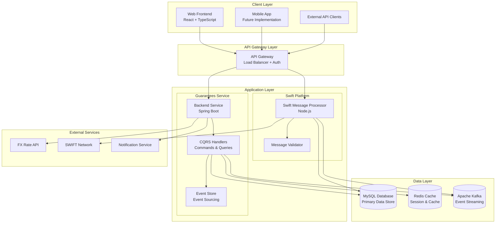

# InterExport Guarantees Module - Architecture Documentation

## Overview

The InterExport Guarantees Module is a comprehensive banking guarantees management system built with modern microservices architecture, implementing the CQRS (Command Query Responsibility Segregation) pattern and event sourcing for optimal performance and scalability.

## High-Level Architecture



## Component Architecture

### 1. Frontend Layer (React + TypeScript)

**Location**: `guarantees-module/frontend/`

**Key Components**:
- **Pages**: Main application views (Dashboard, GuaranteeList, CreateGuarantee, etc.)
- **Components**: Reusable UI components (Layout, LanguageSwitcher, TemplateSelector)
- **Services**: API communication layer
- **Types**: TypeScript type definitions
- **i18n**: Internationalization support (English, Spanish, German)

**Technology Stack**:
- React 18 with TypeScript
- Ant Design UI components
- React Query for state management
- React Router for navigation
- i18next for internationalization

### 2. Backend Service (Spring Boot)

**Location**: `guarantees-module/backend/`

**Package Structure**:
```
com.interexport.guarantees/
├── controller/          # REST API endpoints
├── service/            # Business logic layer
├── repository/         # Data access layer
├── entity/             # JPA entities
├── cqrs/              # CQRS command/query handlers
├── config/            # Configuration classes
├── exception/         # Custom exceptions
├── dto/               # Data Transfer Objects
└── utils/             # Utility classes
```

**Key Features**:
- RESTful API with OpenAPI documentation
- JWT-based authentication
- CQRS pattern implementation
- Event sourcing with Apache Kafka
- Multi-currency support
- Commission calculation engine
- FX rate management

### 3. SWIFT Test Platform

**Location**: `swift-test-platform/`

**Components**:
- **MessageStore**: SWIFT message storage and retrieval
- **SwiftMessageProcessor**: Message processing logic
- **SwiftValidationService**: Message validation
- **Integration Tests**: Automated testing framework

**Technology Stack**:
- Node.js with Express
- SWIFT message parsing
- Integration testing framework

## Data Architecture

### Database Design

**Primary Database (MySQL)**:
- **GuaranteeContract**: Core guarantee entity
- **Amendment**: Guarantee amendments
- **Claim**: Claims against guarantees
- **Client**: Client/applicant information
- **Bank**: Bank information
- **FxRate**: Foreign exchange rates
- **FeeItem**: Commission and fee calculations

**Caching Layer (Redis)**:
- Session storage
- FX rate caching
- Frequently accessed data
- Real-time data updates

**Event Store (Kafka)**:
- Command events
- Domain events
- Integration events
- Audit trail

### CQRS Implementation

**Command Side**:
- `CreateGuaranteeCommand`
- `UpdateGuaranteeCommand`
- `SubmitGuaranteeCommand`
- `ApproveGuaranteeCommand`

**Query Side**:
- `GuaranteeSummaryView`
- `GuaranteeDetailView`
- `ClientListView`
- `FxRateView`

**Event Handlers**:
- `GuaranteeCreatedEvent`
- `GuaranteeUpdatedEvent`
- `GuaranteeApprovedEvent`
- `GuaranteeRejectedEvent`

## Security Architecture

### Authentication & Authorization

1. **JWT Tokens**: Stateless authentication
2. **Role-Based Access Control (RBAC)**: Fine-grained permissions
3. **API Key Authentication**: For external services
4. **OAuth2 Integration**: Ready for enterprise SSO

### Data Protection

1. **Input Validation**: Comprehensive validation at all layers
2. **SQL Injection Prevention**: Parameterized queries
3. **XSS Protection**: Content Security Policy
4. **CSRF Protection**: CSRF tokens
5. **Data Encryption**: At rest and in transit

## Integration Architecture

### External Integrations

1. **FX Rate APIs**: Real-time exchange rate updates
2. **SWIFT Network**: Message processing and validation
3. **Notification Services**: Email, SMS, push notifications
4. **Audit Systems**: Compliance and regulatory reporting

### Internal Integrations

1. **Event Streaming**: Apache Kafka for event-driven architecture
2. **Caching**: Redis for performance optimization
3. **Monitoring**: Prometheus metrics and health checks
4. **Logging**: Structured logging with ELK stack

## Deployment Architecture

### Container Strategy

**Docker Images**:
- `guarantees-backend`: Spring Boot application
- `guarantees-frontend`: React application
- `guarantees-nginx`: Reverse proxy and static file serving

**Docker Compose Services**:
- MySQL database
- Redis cache
- Apache Kafka
- Zookeeper
- Application services

### Environment Configuration

**Development**:
- H2 in-memory database
- Local Redis instance
- Embedded Kafka
- Hot reload enabled

**Staging**:
- MySQL database
- Redis cluster
- Kafka cluster
- Load balancer

**Production**:
- MySQL cluster with replication
- Redis cluster with persistence
- Kafka cluster with high availability
- Kubernetes orchestration

## Performance Architecture

### Scalability Patterns

1. **Horizontal Scaling**: Stateless services
2. **Database Sharding**: By client or region
3. **Caching Strategy**: Multi-level caching
4. **CDN Integration**: Static asset delivery
5. **Load Balancing**: Round-robin and health checks

### Performance Optimizations

1. **Connection Pooling**: Database and HTTP connections
2. **Lazy Loading**: JPA entity relationships
3. **Query Optimization**: Indexed queries and pagination
4. **Caching**: Redis for frequently accessed data
5. **Async Processing**: Non-blocking operations

## Monitoring & Observability

### Metrics Collection

1. **Application Metrics**: Custom business metrics
2. **System Metrics**: CPU, memory, disk usage
3. **Database Metrics**: Query performance, connection pools
4. **Cache Metrics**: Hit rates, eviction rates

### Logging Strategy

1. **Structured Logging**: JSON format with correlation IDs
2. **Log Levels**: DEBUG, INFO, WARN, ERROR
3. **Log Aggregation**: ELK stack (Elasticsearch, Logstash, Kibana)
4. **Audit Logging**: All business operations

### Health Checks

1. **Liveness Probes**: Application is running
2. **Readiness Probes**: Application is ready to serve traffic
3. **Database Health**: Connection and query performance
4. **External Dependencies**: FX APIs, SWIFT network

## Disaster Recovery

### Backup Strategy

1. **Database Backups**: Daily full backups, hourly incremental
2. **Configuration Backups**: Infrastructure as Code
3. **Code Backups**: Git repository with multiple remotes
4. **Data Replication**: Cross-region replication

### Recovery Procedures

1. **RTO (Recovery Time Objective)**: 4 hours
2. **RPO (Recovery Point Objective)**: 1 hour
3. **Failover Procedures**: Automated and manual
4. **Data Validation**: Post-recovery verification

## Compliance & Governance

### Regulatory Compliance

1. **SOX Compliance**: Financial controls and audit trails
2. **PCI DSS**: Payment card data security
3. **GDPR**: Data privacy and protection
4. **Basel III**: Risk management and capital adequacy

### Audit Requirements

1. **Audit Trail**: Complete operation history
2. **Data Retention**: Configurable retention policies
3. **Access Logging**: User activity tracking
4. **Change Management**: Version control and approvals

---

**Last Updated**: December 2024
**Version**: 1.0.0
**Maintainer**: InterExport Development Team
